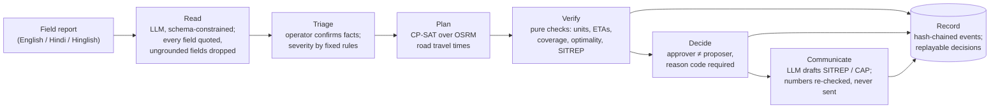

# AegisOps

**Flood reports in, solver-backed response plans out: a human approves each one, every number is
re-checked, and every decision can be replayed.** A research platform, not an emergency system.


*The console on the fictional Lucknow flood exercise: priority queue and map; triaging a
Hinglish report by hand; the CP-SAT plan with verified ETAs; approval by a different person with a
reason code; the hash-chained audit trail. Script: [docs/DEMO.md](docs/DEMO.md).*

## Safety position

AegisOps never dispatches anything:

- Every plan requires human approval.
- A blocked plan cannot be approved.
- Whoever proposed a plan cannot approve it.
- Model output reaches an operator only after deterministic checks.

It runs a fictional exercise set on real Lucknow places and has no connection to any emergency
service. Do not connect it to emergency operations or use it with real personal or operational
data.

## How it works



The model reads reports and drafts prose. A solver allocates units, and pure functions verify
every plan before a person sees it. Why: [ADR 001](docs/adr/001-solver-not-llm-for-allocation.md)
(solver, not LLM), [ADR 002](docs/adr/002-verifier-as-pure-functions.md) (verifier),
[ADR 003](docs/adr/003-hash-chained-audit-log.md) (audit chain),
[ADR 004](docs/adr/004-separation-of-duties.md) (separation of duties). Details:
[docs/ARCHITECTURE.md](docs/ARCHITECTURE.md).

## Results

Every number here comes from a committed file in [`reports/`](reports/README.md).

| Evaluation | Result | Source |
| --- | --- | --- |
| Verifier fault injection: fault classes injected one at a time into seeded scenarios ([method](reports/fault_injection.md)) | Every class caught on every scenario: [13/13 classes, 650/650 faults](reports/fault_injection.md); clean solver plans falsely blocked: [0/50](reports/fault_injection.md) | [reports/fault_injection.md](reports/fault_injection.md), [.json](reports/fault_injection.json) |
| LLM steps: reading reports, translating operator notes, SITREP numbers, end-to-end pass^5, latency, cost | **Not run.** The harness is built and checked against an oracle model; no live model has been run, so no accuracy, latency or cost is claimed | [reports/README.md](reports/README.md) |
| LLM-direct allocation vs CP-SAT on Lucknow scenarios with OSRM road times | **Not run**, for the same reason | [reports/README.md](reports/README.md) |
| User study: old vs new console, timed reviews with injected errors | **No sessions run.** The protocol and instrument are built | [docs/USER_STUDY.md](docs/USER_STUDY.md) |

An earlier report showed the LLM engine "blocked" on every scenario. It was produced without a
model key, so it measured the fallback path, and it is marked superseded in
[reports/README.md](reports/README.md).

## Limitations

- **No live-model results.** The reader, constraint translator, drafting and LLM allocation
  have only been run against mocked or oracle models. The evaluations above have not been run.
- **Road times are free-flow.** OSRM's car profile knows nothing about traffic, closures or
  flooding.
- **The exercise is fictional.** Incidents and reports are written for the exercise. Unit counts
  at facilities are an assumption, and OpenStreetMap's facility coverage is incomplete.
- **The verifier checks only what data can decide.** SITREP numbers must follow a fixed phrasing,
  and instruction detection is pattern-based.
- **No real sign-in.** There are development and demo identities only; no OIDC login is built.
- **Fault injection is not an attack evaluation.** The faults come from mutators written
  alongside the verifier, one at a time.
- **The public demo is configured but not deployed** ([deployment guide](docs/DEPLOYMENT_GUIDE.md)).

What exists, row by row, with the file or test for each: [docs/STATUS.md](docs/STATUS.md).

## Quick start

```bash
./scripts/osrm_prepare.sh     # once: Geofabrik extract -> Lucknow clip -> OSRM graph (needs Docker)
docker compose up --build     # PostGIS, OSRM, Phoenix traces, API, feed worker, console
```

Open http://localhost:5173. On start the API migrates the database, imports the Lucknow
facilities, seeds the exercise and the demo triage reports, and plans the exercise once on road
times (`scripts/compose_api_start.sh`).

Without Docker (Python 3.11–3.13, Node 22):

```bash
python3 -m venv venv && source venv/bin/activate && pip install -r requirements-dev.txt
alembic -c backend/alembic.ini upgrade head && python -m backend.snapshot_seed
AEGISOPS_ENVIRONMENT=development uvicorn backend.main:app --reload --port 8000
npm ci && npm run dev          # console on http://localhost:5173
```

Model steps need `AEGISOPS_LLM_API_KEY` (any OpenAI-compatible endpoint; NVIDIA NIM by default).
Without a key they say so and the rest works. Settings: [ENVIRONMENT.md](ENVIRONMENT.md).
Checks: `pytest`, `ruff check .`, `mypy aegisops`, `npm test`, `npx playwright test`.

## Sources

| Source | Used for | Licence / terms |
| --- | --- | --- |
| [OpenStreetMap](https://www.openstreetmap.org) via [Geofabrik](https://download.geofabrik.de/asia/india.html) | Road network (OSRM), hospitals, fire and police stations, localities, the gazetteer | © OpenStreetMap contributors, [ODbL 1.0](https://opendatacommons.org/licenses/odbl/1-0/); derived data (`data/`, `deploy/osm/`) stays under the ODbL |
| [OpenFreeMap](https://openfreemap.org) vector tiles | Console basemap (greyscale) | © OpenStreetMap contributors (ODbL); © OpenMapTiles; attribution on the map |
| [OSRM](https://project-osrm.org) `osrm-backend` v6.0.0 | Road travel times and routes | BSD 2-Clause |
| [NDMA SACHET](https://sachet.ndma.gov.in) CAP feed | Official Indian disaster alerts (CAP 1.2) | National Disaster Management Authority, Government of India; see the portal for terms |
| [USGS](https://earthquake.usgs.gov/earthquakes/feed/v1.0/geojson.php) `all_day` GeoJSON | Earthquake events | U.S. Geological Survey; public domain unless noted |
| [GDACS](https://www.gdacs.org) event list | Global disaster events | UN / European Commission; see gdacs.org |
| [HumAID](https://crisisnlp.qcri.org/humaid_dataset) tweet IDs and labels | Part of the reader eval set (text fetched at eval time, not committed) | See the dataset page for terms |

## Documentation

- [Architecture](docs/ARCHITECTURE.md), [decision records](docs/adr/README.md),
  [status](docs/STATUS.md)
- [API](docs/API.md), [environment variables](ENVIRONMENT.md), [developer guide](docs/DEVELOPER_GUIDE.md),
  [deployment](docs/DEPLOYMENT_GUIDE.md), [demo script](docs/DEMO.md)
- [Evaluation datasets](evals/data/DATASET.md), [reports](reports/README.md),
  [user study protocol](docs/USER_STUDY.md)
- [Security threat model](docs/SECURITY_THREAT_MODEL.md), [test strategy](docs/TEST_STRATEGY.md),
  [roadmap](docs/ROADMAP.md), [research proposal](docs/RESEARCH_PROPOSAL.md)
- [Implementation Integrity Analyzer](docs/INTEGRITY_ANALYZER.md) (a separate static-analysis
  tool, moving to its own repository)
